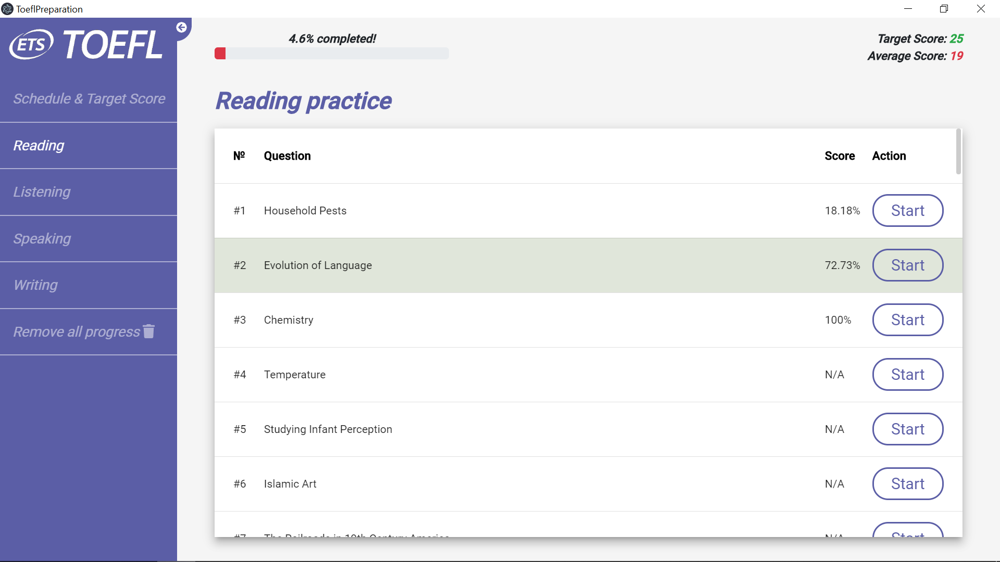
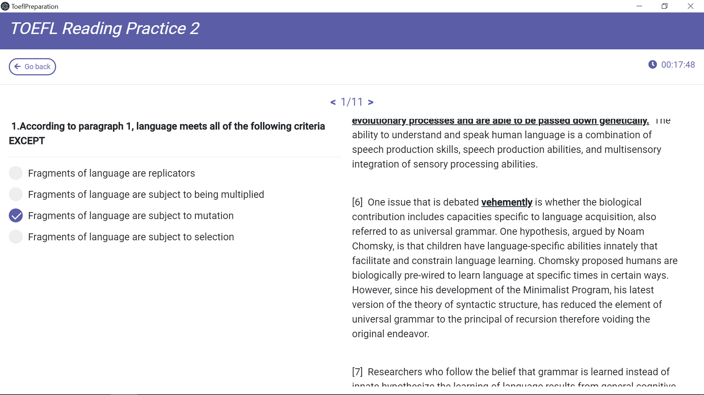
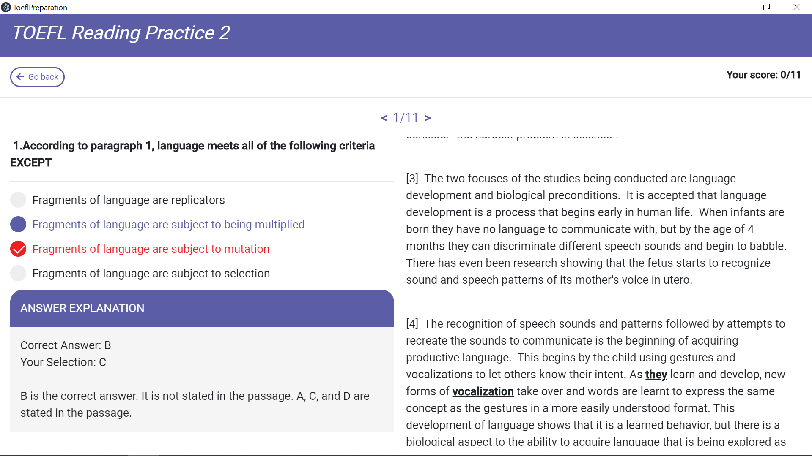
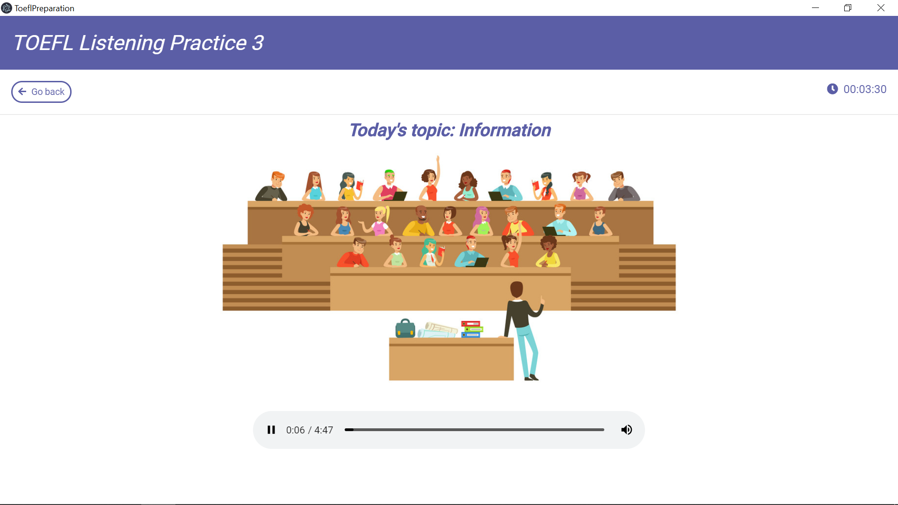
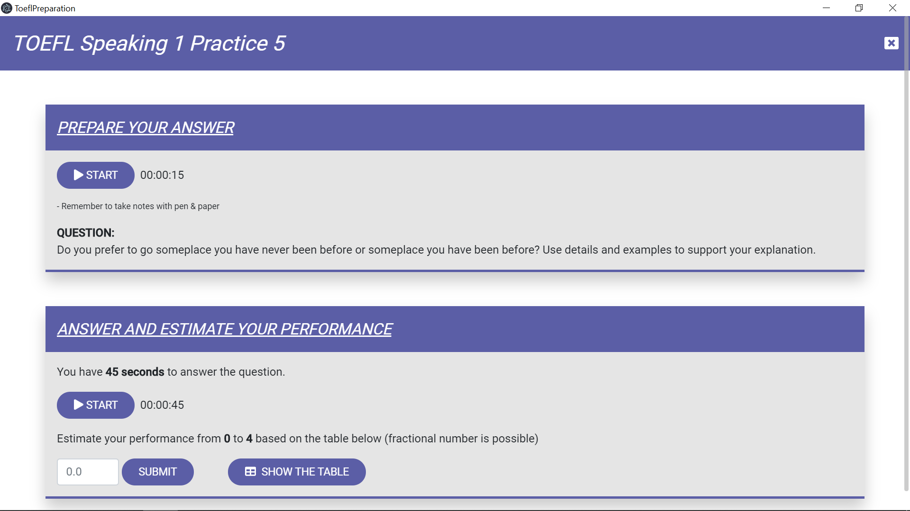
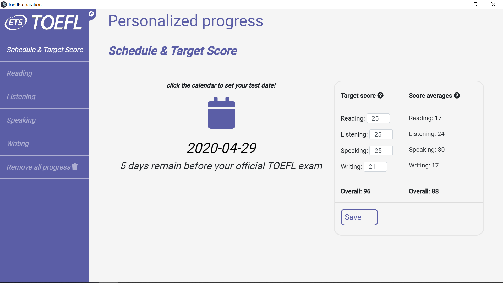

# AppToefl short description

This project is developed to help students pass the TOEFL exam. This application contains reading, listening, speaking, and writing tasks.

## Brief information

In this application, users can set a test date and their desired score for each section. They also can see their progress and their average score for each kind of task.

The start view looks as shown below:

Each reading task includes a passage, questions to it, and the right answers after finishing a section.

<b>Some photos of the reading section.<b>

First reading photo

Second reading photo

The listening section includes either a lecture or a conversation and a number of questions with answers.

<b>Example of the listening section.<b>

The speaking section consists of 6 different types of questions. Each type represents a task with a timer to record the response of a student.

The writing section consists of an independent as well as integrated writing tasks.

As it was said above, a user is able to set a date of the upcoming TOEFL exam and change their target scores in each section.

## Technology stack

To build a cross-platform desktop application, the Electron framework was chosen.
To design and create pages, it was used Angular.
To fetch data from a database (SQLite), it was operated the 'KNEX.JS' library.

## Launching the application

In order to run an application, you just need to type 'npm run start:electron' in a terminal console.

## Important remark!

All view-pages, interactions, business-logic are implemented already.
The database was also integrated, and it works efficiently.
However, because of a big number of routine work, I don't have enough time to store all the exercises in the database.
Therefore, there is available only a limited amount of tasks so far!
I will do all my best to put all the tasks in the database as soon as possible.

## Further help

If you run into any questions or have some suggestions on how to improve this project, do not hesitate to contact me via e-mail antonskripin@gmail.com
